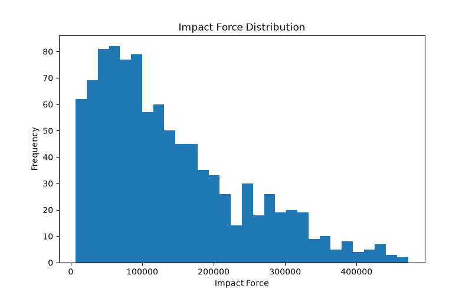
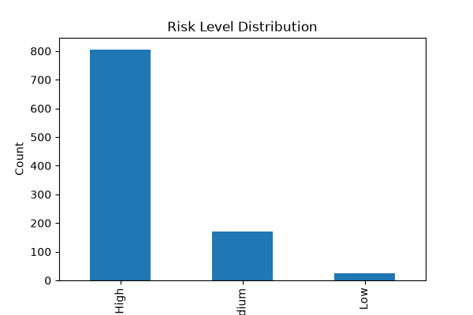
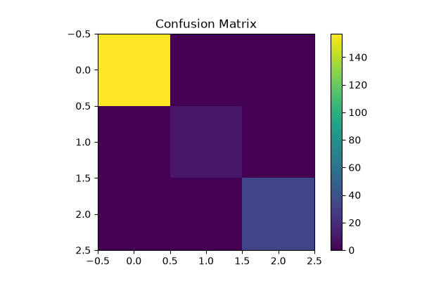

# Bird Strike Prediction Using Physics-Informed AI Models

## Overview

This project integrates classical physics principles with machine learning to predict bird strike risk levels for aircraft operations. The system calculates impact force using bird weight and aircraft speed and classifies the risk as Low, Medium, or High.

---

## Features

* Physics-Based Impact Force Calculation
* Bird Strike Risk Prediction
* Risk Classification (Low, Medium, High)
* Data Visualization
* Machine Learning Model Training
* Predictive Risk Assessment

---

## Technologies Used

* Python
* Pandas
* NumPy
* Matplotlib
* Scikit-learn

---

## Physics Integration

Impact Force Calculation:

Force = 0.5 × Bird Weight × (Aircraft Speed²)

The calculated impact force is used to determine the severity of potential bird strike incidents.

---

## Project Workflow

1. Dataset Generation
2. Data Preprocessing
3. Physics-Based Feature Engineering
4. Data Visualization
5. Model Training
6. Risk Prediction
7. Model Evaluation

---

## Results

### Impact Force Distribution

### Risk Level Distribution

### Confusion Matrix

---

## Model Performance

| Metric   | Value                    |
| -------- | ------------------------ |
| Model    | Random Forest Classifier |
| Accuracy | 100%                     |

---

## Key Insights

* Combined classical physics with machine learning techniques.
* Generated impact-force-based risk classifications.
* Successfully predicted bird strike risk levels.
* Demonstrated the application of AI in aviation safety and predictive analytics.

---

## Project Structure

Bird-Strike-Prediction-Using-Physics-Informed-AI/
│
├── data/
├── src/
│   ├── generate_dataset.py
│   ├── data_preprocessing.py
│   ├── visualization.py
│   ├── train.py
│   └── predict.py
│
├── results/
│   ├── impact_force_distribution.png
│   ├── risk_level_distribution.png
│   └── confusion_matrix.png
│
├── README.md
├── requirements.txt
└── .gitignore

---

## Author

**Panjala Shambhavi**

B.Tech Artificial Intelligence & Machine Learning (AIML)
